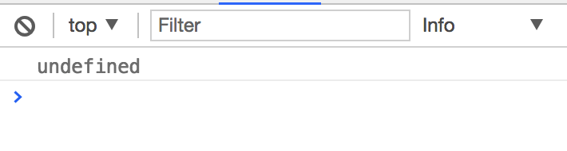
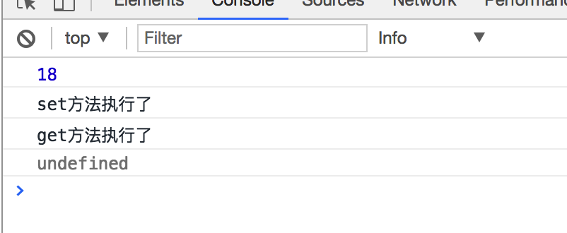
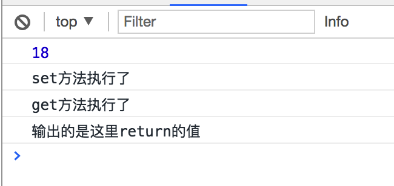
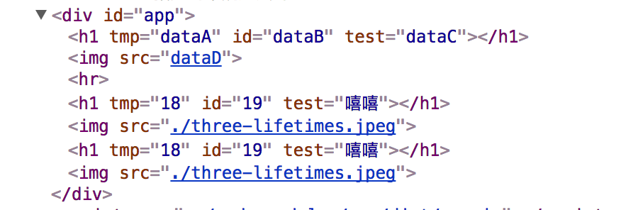
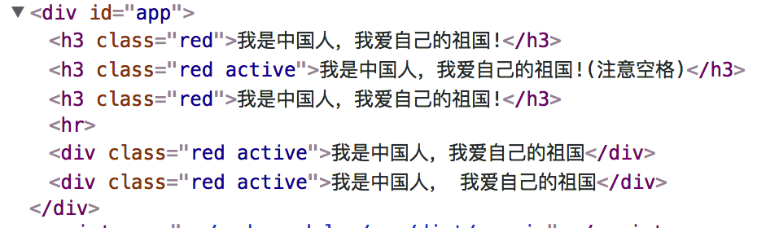
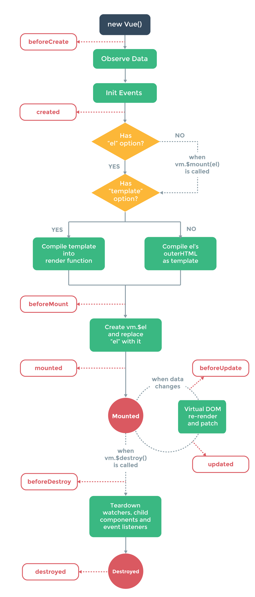

# Vue
## 什么是Vue?
## 为什么要用它?

## 数据绑定!
### 模拟数据绑定
> 详情见`01.data-bind`文件夹中代码!
- v-model 
- v-text

### getter, setter
> Object.defineProperty 方法，是es6(ECMAScript 2015) 中定义的的方法, 作用是为指定的对象定义一个新的属性.
> 以前我们给一个对象添加一个属性直接`obj.xx = yy` 这样就可以了，这样很灵活，`xx`可以被随意的修改或者删除，但是有时候我并不希望这样。
> 通过Object.defineProperty方法定义的属性的值默认是【不可以】被修改的!，强调是【不可以】，【不可以】，【不可以】
> Object.defineProperty 需要开发者提供一个get,和set方法, 假如

Object.defineProperty(对象, 属性名, 描述)  
方法的参数1: 是我们想要为其添加属性的对象  
方法的参数2: 是我们想要添加的属性 
方法的参数3: 也是一个对象,开发者可以给该对象指定一个get方法和set方法，称之为getter，setter。  
> 我们先往下看，慢慢的了解这个get和set方法有什么作用  


```js
var vm = {}
Object.defineProperty(vm, 'name', {}) // 给vm对象添加了一个属性name, 它的值为undefined  
// 尝试着修改vm.name 的值
vm.name = 18
console.log(vm.name) // undefined 输出的还是undefined，也就是说上一句的赋值操作并没有生效  
```
  

> 我们给第三个参数添加get,set 方法
```js
var vm = {}
Object.defineProperty(vm, 'name', {
  get: function () {
    console.log('get方法执行了')
  },
  set: function (val) {
    console.log(val)
    console.log('set方法执行了')
  }
})
vm.name = 18
console.log(vm.name) // undefined 输出的还是undefined
// 但是执行 `vm.name = 18`时set方法执行了,且参数val就是18
// 执行console.log(vm.name)时 get方法执行了，输入的值是undefined, 这个undefined其实是get方法的返回值(没有return 则返回undefined)
```


> 在get 方法中 随便 return 一个值  

```js
var vm = {}
Object.defineProperty(vm, 'name', {
  get: function () {
    console.log('get方法执行了')
    return '输出的是这里return的值'
  },
  set: function (val) {
    console.log(val)
    console.log('set方法执行了')
  }
})
vm.name = 18
console.log(vm.name) // '输出的是这里return的值'
```


## 单向数据绑定

> 可以将js中的数据自动呈现到dom, 并且当我们修改了js中的数据之后，页面的数据也会跟着自动变化, 这种现象叫做单向数据绑定(与具体的实现技术无关，只是给这个现象起了个名字)

### 双向数据绑定!

> 不仅仅，可以将js中的数据自动呈现到dom, 并且当我们修改了js中的数据之后，页面的数据也会跟着自动变化, 这种现象叫做单向数据绑定,
>
> 而且，如果页面中的数据改变了，js中的数据也自动改变了，这种现象，称之为双向数据绑定(双边数据绑定)

详情 `demo/02.getter-setter/c.getter-setter-data-bind`中的代码

> 定义:  
> 如果有一个变量name,我们把这个name的值渲染到input中,如果通过写代码能够达到如下效果，则称之为双向数据绑定:  
> 当修改name的值时(如: name = 18), input中的的值自动更新为name的最新值(也能变为18)。  
> 并且, 当我们通过鼠标或者键盘修改input的中的值时(如修改为 99), name变量的值也能自动变为 99。  


## 开始使用vue
> 使用前准备步骤:  
1. 新建一个html文件  
2. 引入vue.js文件(引入后会有个全局变量Vue,是个构造函数)
3. 创建Vue的实例`var vm = new Vue({})` , 参数是个对象,暂时先传递一个空对象
4. 将实例作用于指定的dom`vm.$mount('选择器')`

### 指令

> vue中对html中特定的属性做了专门的处理，使得这些属性可以方便开发都书写项目，这些特殊的属性，我们称之为指令！
> 补充: vue 的指令中除了直接写固定值外，还可以书写js表达式  
> *在Vue的指定中可以直接书写`js表达式`*, 普通属性中写js表达式是无效的

#### 数据绑定
> 作用: 将数据渲染到html中(注意: 以下指令无法将数据渲染到标签的属性中)  
> 详见`03.v-text,v-html,{{}}`文件夹中参考代码  

- v-text指令
- v-html指令
- {{}}指令

> 指令中也可以调用方法,但是方法必需申明在methods中！

- `v-text` 与 `{{}}` 及 `v-html` 的区别:  
  + `v-text`是写在标签的属性上的, `v-text` 指定的表达式的值会被赋值标签的innerText  
  + `{{}}` 是写在非标签的属性位置, `{{}}` 指定的表达式的值会替换 {{}} 本身!
  + `v-html`也是写在标签的属性上的, `v-html` 指定的表达式的值会被赋值给标签的innerHTML

#### 属性绑定
> `v-text, v-html, {{}}` 的能力确实很强大!, 但是他们只能将数据渲染到标签之间位置!    
> 只能将指定的数据赋值给标签的innerText或者 innerHTML, 但是如果我想给标签的某个属性赋值呢？  
> 如果需要给标签的某个属性赋值就需要使用v-bind指令了!
> 作用: 将js表达式的结果赋值给指定的标签的属性

##### 常规的属性绑定
- v-bind
  语法: `<div v-bind:要设置的属性名="js表达式"></div>`  
```html
<div id="app">
  <!--未使用v-bind时  -->
  <h1 tmp="dataA" id="dataB" test="dataC"></h1>
  
  <hr>
  <!--使用v-bind时  -->
  <h1 v-bind:tmp="dataA" v-bind:id="dataB" v-bind:test="dataC"></h1>
  
  <!--v-bind简写,简写就是把v-bind去除，只保留一个冒号  -->
  <h1 :tmp="dataA" :id="dataB" :test="dataC"></h1>
  
</div>
```
```js
var vm = new Vue({
  data: function () {
    return {
      dataA: 18,
      dataB: 19,
      dataC: '嘻嘻',
      dataD: './three-lifetimes.jpeg'
    }
  }
})
vm.$mount('#app')
```
渲染出来的效果  



##### 操作class属性
> 当v-bind用来给class属性赋值时，使用方式有些特殊，这是需要注意的!  
> 示例代码如下: 详见`04.v-bind/b.class.v-bind.html`  

```html
  <div id="app">
    <!--将 'red' 值追加给 class属性 -->
    <h3 v-bind:class=" 'red' ">我是中国人，我爱自己的祖国!</h3>
    <!--注意空格  -->
    <!--将 'red' + ' active'的值追加给class属性:  'red active'  -->
    <h3 v-bind:class=" 'red' + ' active'">我是中国人，我爱自己的祖国!(注意空格)</h3> 
    <!-- 将dataC的值,追加给class, 也就是将'red'追加给class -->
    <h3 v-bind:class="dataA">我是中国人，我爱自己的祖国!</h3>

    <hr>
    <!--接下来是高级用法了  -->
    <!--Vue内部会找到obj对象, 遍历obj, 如果属性的值为true, Vue就会将属性名(注意，这里说的是属性名),追回给class属性  -->
    <div v-bind:class="obj">我是中国人，我爱自己的祖国</div>
    <!--或者这样写也可以  -->
    <div v-bind:class="{red: true, active: true, hello: false}">我是中国人， 我爱自己的祖国</div>
  </div>
```
```js
  var vm = new Vue({
    data: function () {
      return {
        dataA: 'red',
        obj: {red: true, active: true, hello: false}
      }
    }
  })
  vm.$mount('#app')
```
> 执行结果:  
> 


#### 条件渲染

> 这是vue提供的一种，更轻松的让dom元素显示或者隐藏的方式

- v-show
- v-if/v-else
  *v-else所在标签的前一个兄弟标签，必需要有v-if*

#### 列表渲染
> 根据数据自动生成多个标签标签  
> 比如: 可以根据数组[1,2,3,4] 自动生成四个标签
- v-for
  + 数组
  + 整数

#### 表单控件数据绑定
> 将数据与表单控件进行绑定(如input,select)
- v-model

#### 注册事件
> Vue允许开发者使用`v-on`属性来快捷的注册事件
- `v-on`
- 语法: `<div v-on:事件名="js表达式"></div>`, 当事件被触发时，这里的js表达式才会被执行

> 这里以注册点击事件为例:详见`04.v-one/a.event.html`

```html
<div id="app">
  {{count}} <br>
  <!--属性值依然写js表达式,点击按钮时，这个表达式就会执行  -->
  <button v-on:click="count = count + 1">值+1</button>
  <!--当点击按钮时就会执行helloA方法,   -->
  <!--如果调用方法时，如果不需要传递参数给该方法，就可以省略括号  -->
  <button v-on:click="helloA">点击事件</button>
  <!--如果调用方法时，需要传递参数给该方法时，就不能省略括号  -->
  <button v-on:click="helloB(99, '小明', {a:1,b:2}, count)">点击事件</button>
  <button v-on:click="helloC">查看事件回调函数中的this</button>

  <!--注册事件时，v-on指令可以简写，就是把 v-on: 简写为一个 @ 符号, 其他地址不变 -->
  <button @click="helloB(99, '小明', {a:1,b:2}, count)">简写</button>
</div>
```
```js
var vm = new Vue({
  // 数据放在data中
  data: function () {
    return {
      count: 1
    }
  },
  // 方法放在methods中
  methods: {
    helloA: function () {
      window.alert('hello word!')
    },
    helloB: function (argA, argB, argC, argD) {
      console.log(argA, argB, argC, argD)
    },
    helloC: function () {
      console.log(this)
      // Vue会将每一个通过v-on注册的事件回调函数中的this更改为Vue的实例,也就是这里的vm
      console.log(this === vm) // true
      this.count = 99
    }
  }
})
vm.$mount('#app')
```
> 将上述代码添加到html中, 然后点击不同的按钮查看效果！  

示例: 点击值 +1, 大于10时，隐藏某个元素, 点击值 -1, 小于10时，显示某个元素


### Vue中的事件修饰符

1. .stop ：event.stopPropagation()阻止单击事件冒泡
2. .prevent ：调用 event.preventDefault()
3. .capture ：添加事件侦听器时使用 capture(捕获) 模式
4. .self ：只当事件在该元素本身（而不是子元素）触发时触发回调
5. .once ：只在指定按键上触发回调
6. 修饰符串联写法 ：v-on:click.stop.prevent
7. 只有修饰符 ：<form v-on:submit.prevent></form>

### Vue中的按键修饰符
> 按方向键移动飞机
1. .enter（按回车键捕获）
2. .tab（按tab键捕获）
3. .esc（按esc键捕获）
4. .space（按空格键捕获）
5. .up（按↑键捕获）
6. .down（按↓键捕获）
7. .left（按←键捕获）
8. .right（按→键捕获）
9. .ctrl（按ctrl键捕获）
10. .alt（按alt键捕获）
11. .shift（按shift键捕获）
12. .字母（1.0.8+： 支持单字母按键别名）
13. 1.0.17+： 可以自定义按键别名：写法：Vue.directive('on').keyCodes.f1 = 112

### 过滤器

> 作用: 在数据被渲染之前，可以对其进行进一步处理，比如将字符反转，或者将小写统一转换为大写等!
>
> *过滤器本身就是一个方法*


> 示例1: 在消息展示之前将其反转!

```html
<div id="app">
  <p>
    <!-- 这里的意思是调用 filters中的 reverse方法，并将msg传递过去: reverse(msg)-->
    {{msg | reverse}
  </p>
</div>
```

```javascript
var vm = new Vue({
  data: function () {
    return {msg: 'WoShiZhongGuoRen'}
  },
  // 过滤器函数都定义在filters属性中,一个属性(方法)就是一个过滤器
  filters: {
    reverse: function (val) {
      // 反转val字符串
      return val.split('').reverse().join('')
    }
  }
})
```

> 渲染后的结果

```html
<div id="app">
  <p>
    enRouGgnohZihSoW
  </p>
</div>
```


> 示例2: 将字母转换为大写
>
> 就是在数据展示之前，将数据改成别的形式展示（不会影响原数据）
>
> ABC => ccc
>
> 123.998 =>  124.0

### 计算属性
> 如果想精确的控制一个数据的变化, 并在变化时做一些操作，则可以使用计算属性！ 
> 比如，想要在用户输入用户名时，实时的判断用户名是否符合要求

```javascript
// 定义计算属性
var vm = new Vue({
  data: function () {
    // 用户名
    username: ''
  }
  computed: {
    // 属性也是一个对象，这个对象有两个属性,
    // get和set方法中的this就是vm
    // 如果只用一个get，可以可以设置myname为一个函数，这个函数就是get
    // 使用时，就把这当作data中的属性去用就可以了
    myname: {
      get: function () {
  		return this.username // 这里this就是vm
	},
      set: function (val) {
        this.username = val
      }
    }
  }
})
```

```javascript
//myname: function () {} 这个就相当于下面的写法
myname: {
  get: function () {}
}
```


## axios - (ajax)

> 专门用于发ajax请求的库, 本身与vue并没有关系，在其他没有使用vue的项目同样可以使用

[文档地址](https://www.npmjs.com/package/axios)

- 常规发请求的写法

  ```javascript
  axios({
    url: '/question',
    method: 'get', // get/post
    parms:{}, // method为'get'时使用这个写参数!
    data:{}   // method为'post'是使用这个写参数
  }).then
  ```

  ​


- get请求简写1

  ```javascript
  axios.get('/question?id=998')
    .then(function (response) {
      // 请求成功的回调函数
      console.log(response);
    })
    .catch(function (error) {
      // 请求失败的回调函数
      console.log(error);
    });
  ```

  ​


- get请求简写2

  ```javascript
  // 发送get请求时，也可以将url中的参数，以key,value的形式写在params属性中
  // axios在发出请求之前，会自动将参数拼接到请求地址上去
  axios.get('/question', {
      params: {
        id: 12345
      }
    })
    .then(function (response) {
      console.log(response)
    })
    .catch(function (error) {
      console.log(error)
    })
  ```

  ​

- post请求简写

  ```javascript
  axios.post('/question', {
      age: 18,
      name: '小明'
    })
    .then(function (response) {
      console.log(response)
    })
    .catch(function (error) {
      console.log(error)
    })
  ```


## 调查问卷案例!

## Vue实例的属性

- `$refs`
- `$el`
- `$emit`和`$on`

## Vue中的生命周期函数

### 什么是生命周期?

Vue中的代码在从开始执行，到执行结束，期间，它会不断的调用一些特定的方法, 这个过程叫做生命周期!

Vue中这个过程中调用的方法我们叫做生命周期函数(生命周期钩子函数)

mounted, created

### 生命周期函数有哪些2?

- beforeCreated () {}

  > Vue在代理data及methods, computed中属性之前会先调用一下beforeCreated 方法， 此时Vue的实例虽然已经创建完成，但是由于还没有代理data中的属性，所以也就无法通过`this.xx` 使用data中数据了

  ```javascript
  var vm = new Vue({
    el: '#app',
    data: function () {
      return {name: '小明'}
    },
    beforeCreate: function () {
      this.name = '小红' // 这句话执行之后，仅仅是让this.name属性值为小红, 并没有对 data中的name产生影响
    }
  })
  ```

  ​

  ​

- created () {}

  > Vue在代理了data及methods,computed中的属性之后会调用created方法，此时可以通过`this.xx` 来使用data中的属性了

  ```javascript
  var vm = new Vue({
    el: '#app',
    data: function () {
      return {name: '小明'}
    },
    created: function () {
      // 此时由于 vm 已经代理了data中的数据, this.name='小红'执行之后，data中的name也会变成小红
      this.name = '小红'
    }
  })
  ```

  ​

- beforeMount () {}

  > Vue在将模板插入到dom中之前会先调用一下, beforeMount方法

- mounted () {}

  > 当vue会在自己所操作的dom部分解析完成之后, 自动调用mounted 方法
  >
  > 如果些方法，没有执行，则说明dom树没有渲染完成!

  > 假设我们想在页面加载完成就上input获取焦点，可以这么做:

  ```html
  <div id="app">
    <input id="ipt">
  </div>
  ```

  ```javascript
  var vm = new Vue({
    el: '#app',
    created: function () {
      // 这个方法里不可以操作#app 之内的dom,因为此时dom树还没有创建完成!
      //var oIpt = document.getElementById('ipt')
    },
    mounted: function () {
      // 此时可以操作dom了
      var oIpt = document.getElemnetById('ipt')
      oIpt.focus() // 获取焦点
    }
  })
  ```

- beforeUpdate  () {}

  > 当我们修改data中的数据之后，Vue就会立即将修改后的数据更新到dom中,但是在更新之前它会调用一下beforeUpdate 方法。  
  >
  > 也就是说在这个beforeUpdate方法执行时，页面中的数据与data中的数据并不是完全一致的!

  ​

- updated () {}

  当我们修改data中的数据之后，Vue就会立即将修改后的数据更新到dom中, 在更新好dom之后，它就会立即调用updated方法,此时页面中的数据与data中的数据是100%一致的

- beforeDestroy () {}

  > 当我们调用 `this.$destroy`方法，Vue就会自动调用beforeDestroy方法，该方法执行之后Vue会将通过Vue注册的事件取消，所有的通过Vue实现的数据绑定与事件将不再生效

- destroyed () {}

  > Vue在取消了数据绑定及dom和取消事件监听之后就会调用这个destroyed方法

## 框架和库的区别

<!--不管理是框架还是库都库!

使用了框架之后，代码思路会发生变化。

库是封装了方法，让我们使用更方便!,我们调用方法为主！

框架是有自己的一套写代码的规则，我们按照它的规则写代码，框架帮我们实现对应的效果-->

## 组件

#### 什么是组件?
> 它是一种开发思想, 是一种新的开发时的思维方式!


#### 组件的生命周期

## 组合之间传值
### 父往子传
- 1.props
- 2.ref

### 子往父传 或者 非父子关系的组件或者父往子传!
- 1.bus

## Vue中的单文件组件
> 只是组件的另一种写法, 本质和前面的还是一样的!, 这种写法在页面内容较多时，是比较方便的!  

## Vue路由

### Vue路由是什么?
### Vue跌由怎么使用?


## vue-cli 工具

## npm

> npm 是一款专门用来下载各种前端或者node开发中需要使用的包的命令行工具!

## webpack

> webpack是一款模块化的打包工具，其本身的作用是将多个js文件打包成一个单独的js文件。
>
> 通过配合它的插件(plugins)和加载器(loaders) 还可以做一些语法转换以及将其他类型的文件打包到js文件中。

- webpack打包时并不是直接将多个个文件合并，而是根据【依赖关系】进行打包的

  例如: a.js 文件如果依赖于b.js , 则使用webpack在打包a.js时，会自动将b.js与a.js合并到一个新的文件中.

- webpack使得我们不需要在html通过script标签引入js的顺序来表明js的依赖关系

```javascript
	// 一些包
	npm i webpack css-loader style-loader url-loader file-loader vue-loader vue-template-compiler html-webpack-plugin -S
    
	"css-loader"   // 用于处理css文件之间的依赖关系
    "style-loader" // 用于生成将css插入到dom中的js代码
    "url-loader"   // 用于处理css中使用到的的图片文件
    "file-loader"  // 用于处理其他loader无法处理的文件, 仅仅是项目中使用到的其他文件复制指定的目录中
    "vue-loader"   // 用于处理Vue的单文件组件，即 *.vue后缀的文件
    "vue-template-compiler" // 这是vue-loader依赖包,
    "html-webpack-plugin" // 用于根据一个html复制出别一个html文件，并自动引入通过webpack打包后的js文件!
    "webpack"      // 这就是webpack这个包本身
    
```


## 天数安排
### 第一天
> vue数据绑定原理
> 什么是双向数据绑定!
> vue指令一些指令(可能不包含v-for)(事件修饰符也看情况)
> 事件!
> axios
> 问卷案例绑定!

### 第二天
> 过滤器
> 计算属性
> $watch
> 完善调查问卷案例
> v-for
> vue实例的生命周期!
> 

实例的属

提前安装node(第三天需要使用, 提前安装vue-cli, 第三天需要使用)
### 第三天
vue 中的组件
vue 中的组件的生命周期
vue 组件之前相互传值
单文件组件
cli,怎么引入样式什么的!
用微信页面练习组件!

### 第四天
vue中的路由
vue路由的基本使用
vue路由动态匹配(Dynamic Routes Matching)
vue嵌套路由(Nested Routes)
vue命名路由

跳转和别名
微信页面做路由练习!

### 第五天
项目
1 >  结构搭建，登陆
2 >  退出登陆!
2 >  展示用户信息
3 >  导航菜单交互
### 第六天
讲师管理!

### 第七天
项目

### 第八天
> 自己配置webpack打包项目


vm代理了data中的数据

### Vue实例的一些属性方法，和事件!

- $refs
- $mount
- bus : $emit和$on
- $nextTick
